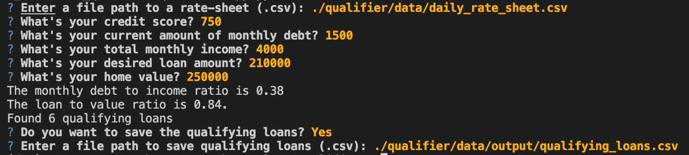

# Loan Qualifier Application

The loan qualifier project is a python command-line interface application that allows users to see qualifying loans from lenders quickly and easily.

The application works by that taking in a `daily_rate_sheet` of loan criteria from various loan providers, asks the user a number of questions to evaluate their loan eligibility, and then returns to them a list of qualifying loans.

The user then has the ability to externally download and save the list of loan dat.

---

## Technologies

This project leverages python 3.7.9 with the following packages:

* [fire](https://github.com/google/python-fire) - For the command line interface, help page, and entrypoint.

* [questionary](https://github.com/tmbo/questionary) - For interactive user prompts and dialogs

* [pytest](https://docs.pytest.org/en/stable/) - For basic assertion testing of financial calculators and filters, and filio.

On the terminal, under the conda dev environment, install the following:

---

## Installation Guide

Before running the application first install the following dependencies.

```
  pip install fire
  pip install questionary
  pip install pytest
```

---

## Usage

1. To use the loan qualifier application simply clone the repository and run the **app.py** with:

    ```python app.py```

2. Next enter a file path for the daily rate sheet:

    ```./data/daily_rate_sheet.csv```

3. Then enter a customers information, credit score, debt, monthly income, loan amount and home value:

    ```
    750
    1500
    4000
    210000
    250000
    ```

4. The program will then calculate the customers debt-to-income ratio and their loan-to-value ratio and create a list of any loean they qualify for.

5. The program will then ask if and where you want to save the loans.

See screenshot below for full usage:

  

---

## Contributors

Nathan Patterson

---

## License

MIT
